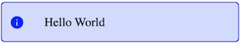

# Toaster component for hogosuru

Toaster implementation for hogosuru

## How to use?

Create a hogosurutoaster.Toaster or attach it to a hogosuru container and return as rendering.

You can now use directly the hogosurutoaster.Toaster instance to send message with AddMessage or CustomMessage function

With standard:



With custom colors and icon:  


You can also use custom event if you not have the reference of the instance:

JS code:

```
document.dispatchEvent(new CustomEvent("hogosurutoaster-notify",{detail: {type: "warn",message:"Hello World!!!!!"}})
document.dispatchEvent(new CustomEvent("hogosurutoaster-customnotify",{detail: {message:"Hello World!",fontColor:"white",backgroundColor:"Black",borderColor:"black",materialDesignIcon:"warning",materialDesignIconColor:"yellow"}}))
```

Go code:
```
if d, err := document.New(); hogosuru.AssertErr(err) {

		if e, err := customevent.New("hogosurutoaster-notify", map[string]interface{}{"type": "warn", "message": "Hello World!!!!!"}); hogosuru.AssertErr(err) {
			d.DispatchEvent(e.Event)
		}

}

```
if d, err := document.New(); hogosuru.AssertErr(err) {

		if e, err := customevent.New("hogosurutoaster-customnotify", map[string]interface{}{"message": "Hello World!!!!!","fontColor":"white","backgroundColor":"Black","borderColor":"black","materialDesignIcon":"warning","materialDesignIconColor":"yellow"}); hogosuru.AssertErr(err) {
			d.DispatchEvent(e.Event)
		}

}
```
## Try github example

https://realpy.github.io/hogosurutoaster/example/dist/index.html

More info soon
